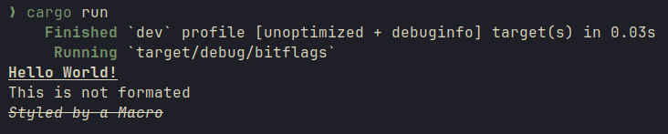

# Bitflags

Let's cover how to implement __Bitflags__ in __rust__.

## Goal

Our goal is a to allow simple text formating with these styles:  
- __BOLD__
- _ITALIC_
- ~~STRIKETHROUGH~~
- <ins>UNDERLINE</ins>
- RESET

> [!IMPORTANT]  
> Your **Terminal must support** the used **[ANSI escape codes](https://en.wikipedia.org/wiki/ANSI_escape_code)**.  
> The text wont get formatted if your __Terminal__ doesn't support those codes

In the end we should be able to do this:

```rust
fn main() {
    println!(
        "{}Hello World!{}\nThis is not formated",
        Styles::UNDERLINE | Styles::BOLD,
        Styles::RESET
    );

    styled_print!("Styled by a Macro", Styles::STRIKETHROUGH | Styles::ITALIC)
}

```

As you can see we can use multiple styles at once by using:  
```rust
let bold_underline_italic = Styles::BOLD | Styles::UNDERLINE | Styles::ITALIC;
```

This behaviour gets achieved by using __Bitflags__.

## The Magic behind this

We are using the `|` *(or)* operator for all this.  
This is a [`Bitwise Operator`](https://doc.rust-lang.org/book/appendix-02-operators.html) and you can implement your own custom behaviour for the `|` *(or)* operator by using the `BitOr` **trait**.  
We combine this with `const` values that contain your custom type, but more on this later.

## Implementation 

We firstly define all the **ANSI** codes in a new file:

```rust
// src/styles.rs

// Not all terminals support these codes!
const RESET: &str = "\x1b[0m";
const BOLD: &str = "\x1b[1m";
const ITALIC: &str = "\x1b[3m";
const UNDERLINE: &str = "\x1b[4m";
const STRIKETHROUGH: &str = "\x1b[9m";
const HIDDEN: &str = "\x1b[8m";

const ALL_STYLES: [&str; 6] = [RESET, BOLD, ITALIC, UNDERLINE, STRIKETHROUGH, HIDDEN];
// Less clearer but less code
//const ALL_STYLES: [&str; 6] = ["\x1b[0m", "\x1b[1m", "\x1b[3m", "\x1b[4m", "\x1b[9m", "\x1b[8m"];

```

Now we start with the `Styles` struct. 

```rust
// src/styles.rs

#[derive(Clone, Copy)]
pub struct Styles(u8);
```

We have less than 8 *flags* therefore we can use a `u8` (If we had more than 8 flags we would use an `u32`).  
Now we define the inner flags inside the `Styles` struct. 

```rust
// src/styles.rs

// -- snip --

impl Styles {
    pub const RESET: Self = Self(1);                // 00000001
    pub const BOLD: Self = Self(1 << 1);            // 00000010
    pub const ITALIC: Self = Self(1 << 2);          // 00000100
    pub const UNDERLINE: Self = Self(1 << 3);       // 00001000
    pub const STRIKETHROUGH: Self = Self(1 << 4);   // 00010000
    pub const HIDDEN: Self = Self(1 << 5);          // 00100000
}
```

These `const` have a `Styles` struct inside them with diffrent `u8` values.  
Let's break down this part `Self(1 << n)`. If you aren't familiar with **[Bitwise Operators](https://dev.to/stephengade/mastering-bitwise-operations-a-simplified-guide-2031)** this probably seems confusing. for the sake of this short tutorial we wont cover all **Bitwise Operatores**. But let me explain `1 << n`. We just add `n` zeros on the left side of the number (in this case 1):  

```vim
1 << 0
Add 0 zeros on the left side of 1 -> 1

1 << 1
Add 1 zero on the left side of 1 -> 10

1 << 2
Add 2 zeros on the left side of 1 -> 100

1 << 3
Add 3 zeros on the left side of 1 -> 1000

1 << 4
Add 4 zeros on the left side of 1 -> 10000

1 << 5
Add 5 zeros on the left side of 1 -> 100000
```

Now after we understand this we can implement the `BitOr` trait:

```rust
// src/styles.rs

// -- snip --

impl BitOr for Styles {
    type Output = Self;

    fn bitor(self, rhs: Self) -> Self::Output {
        Self(self.0 | rhs.0)
    }
}

```

We just use the inner _(`u8`)_ values and **add** them together. 

```vim
    00000010
    00000001
    00010000
    ---------   <-- Or Operator 
    00010011    <-- All u8 values above got added together. Reslt of 00000010 | 00000001 | 00010000

```

Our `Styles` struct is now able to be used like this: `Styles::BOLD | Styles::ITALIC`. But we aren't finished. Our `Styles` struct is pretty much useless right now, because it doesn't **apply** these **styles**.  
So let's add a function that reads all bits and apply the corresponding styles.

```rust
// src/styles.rs

const RESET: &str = "\x1b[0m";
const BOLD: &str = "\x1b[1m";
const ITALIC: &str = "\x1b[3m";
const UNDERLINE: &str = "\x1b[4m";
const STRIKETHROUGH: &str = "\x1b[9m";
const HIDDEN: &str = "\x1b[8m";

const ALL_STYLES: [&str; 6] = [RESET, BOLD, ITALIC, UNDERLINE, STRIKETHROUGH, HIDDEN];
// Less clearer but less code
//const ALL_STYLES: [&str; 6] = ["\x1b[0m", "\x1b[1m", "\x1b[3m", "\x1b[4m", "\x1b[9m", "\x1b[8m"];


impl Styles {

// -- snip --
// (all constants here)


    fn styles_as_string(&self) -> String {
        let mut combined_styles: String = String::new();
        for (index, style) in ALL_STYLES.iter().enumerate() {
            let bit = (self.0 >> index) & 1;
            if (bit == 1) {
                combined_styles.push_str(style);
            }
        }
        return combined_styles;
    }


 pub fn style(self) -> String {
        self.styles_as_string()
    }
}

```

This methode loops through each and every style from the const array `ALL_STYLES` and gets the bit on the correct position. If the bit is `1` the string representation of style gets added to the `String` that gets returned. The `style()` function provides a cleaner interface for outside use.   
To be able to use our `Styles` struct in a `print!()` statement we implement the `Display` trait.  
  

```rust
// src/styles.rs

impl Display for Styles {
    fn fmt(&self, f: &mut std::fmt::Formatter<'_>) -> std::fmt::Result {
        write!(f, "{}", self.styles_as_string())
    }
}

```
  
We wont go into the details of how the `Display` trait works and what these function parameters are for the `fmt()` function.  
We are using the methode from above to _convert_ the `Styles` struct to a `String`.  
The las thing we do is create our `macro` to use all this in a more convenient way.

```rust
// src/styles.rs

#[macro_export]
macro_rules! styled_print {
    ($text:expr, $style:expr) => {
        println!("{}{}{}", Styles::style($style), $text, Styles::RESET)
    };
}

```

Let's put it all together for completeness reason:

```rust

#![allow(unused)]
use std::{fmt::Display, ops::BitOr};

// Not all terminals support these codes!
const RESET: &str = "\x1b[0m";
const BOLD: &str = "\x1b[1m";
const ITALIC: &str = "\x1b[3m";
const UNDERLINE: &str = "\x1b[4m";
const STRIKETHROUGH: &str = "\x1b[9m";
const HIDDEN: &str = "\x1b[8m";

const ALL_STYLES: [&str; 6] = [RESET, BOLD, ITALIC, UNDERLINE, STRIKETHROUGH, HIDDEN];
// Less clearer but less code
//const ALL_STYLES: [&str; 6] = ["\x1b[0m", "\x1b[1m", "\x1b[3m", "\x1b[4m", "\x1b[9m", "\x1b[8m"];

#[derive(Clone, Copy)]
pub struct Styles(u8);

impl Styles {
    pub const RESET: Self = Self(1);
    pub const BOLD: Self = Self(1 << 1);
    pub const ITALIC: Self = Self(1 << 2);
    pub const UNDERLINE: Self = Self(1 << 3);
    pub const STRIKETHROUGH: Self = Self(1 << 4);
    pub const HIDDEN: Self = Self(1 << 5);

    fn styles_as_string(&self) -> String {
        let mut combined_styles: String = String::new();
        for (index, style) in ALL_STYLES.iter().enumerate() {
            let bit = (self.0 >> index) & 1;
            if (bit == 1) {
                combined_styles.push_str(style);
            }
        }
        return combined_styles;
    }

    pub fn style(self) -> String {
        self.styles_as_string()
    }
}

impl Display for Styles {
    fn fmt(&self, f: &mut std::fmt::Formatter<'_>) -> std::fmt::Result {
        write!(f, "{}", self.styles_as_string())
    }
}

impl BitOr for Styles {
    type Output = Self;

    fn bitor(self, rhs: Self) -> Self::Output {
        Self(self.0 | rhs.0)
    }
}

#[macro_export]
macro_rules! styled_print {
    ($text:expr, $style:expr) => {
        println!("{}{}{}", Styles::style($style), $text, Styles::RESET)
    };
}


```

Last but not least we use our newly created `struct` and `macro` in our `src/main.rs` file.

```rust
// src/main.rs

mod styles;
use styles::Styles;
fn main() {
    println!(
        "{}Hello World!{}\nThis is not formated",
        Styles::UNDERLINE | Styles::BOLD,
        Styles::RESET
    );

    styled_print!("Styled by a Macro", Styles::STRIKETHROUGH | Styles::ITALIC)
}

```

Running this prints the text as expected, **except if your terminal (emulator) does NOT support ANSI color codes!**



## Summary

We implemented our own little style `struct` that allows the user of our `struct` to format text with ease and multiple styles at onces by using the __or__ (`|`) operator.  The user of our `struct` is able to use the `styled_print()` `macro` for simple and understandable use of the `Styles` struct!  
**Congrats!**
